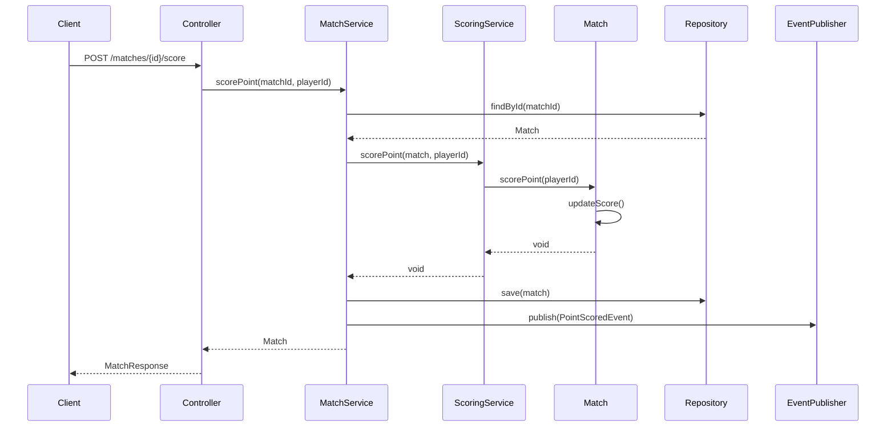
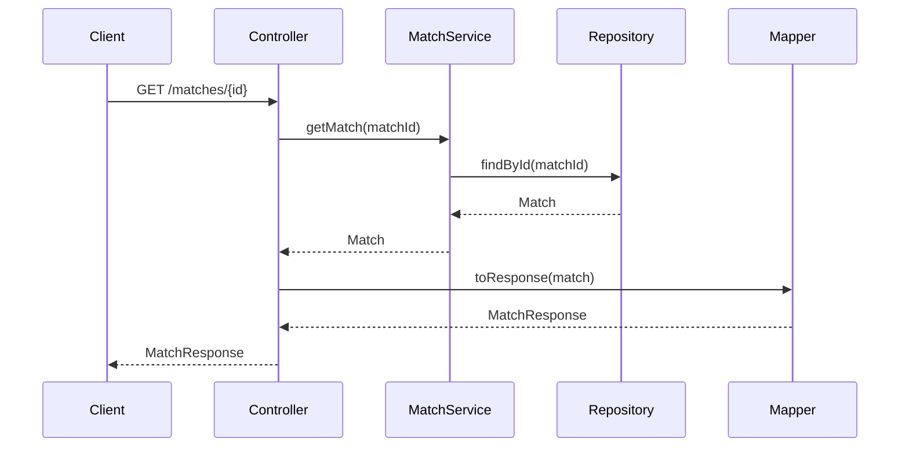

# Tennis Scoring System Architecture

This document describes the architecture and design decisions for the Tennis Scoring System.

## Overview

The Tennis Scoring System is built using **Hexagonal Architecture** (also known as Ports and Adapters) principles, ensuring clean separation of concerns and high testability.

## Architecture Principles

### 1. Hexagonal Architecture (Ports and Adapters)

The system is organized into three main layers:

```
┌─────────────────────────────────────────────────────────────┐
│                    Primary Adapters                        │
│                   (Driving Adapters)                       │
│  ┌─────────────────┐  ┌─────────────────┐                 │
│  │   REST API      │  │   Web UI        │                 │
│  │  Controllers    │  │   (Future)      │                 │
│  │                 │  │                 │                 │
│  │ - MatchController│  │ - React/Vue     │                 │
│  │ - Exception     │  │ - WebSocket     │                 │
│  │   Handlers      │  │   Client        │                 │
│  └─────────────────┘  └─────────────────┘                 │
└─────────────────────────────────────────────────────────────┘
                              │
                    ┌─────────────────┐
                    │      Ports      │
                    │                 │
                    │ - Primary Ports │
                    │ - Secondary     │
                    │   Ports         │
                    └─────────────────┘
                              │
┌─────────────────────────────────────────────────────────────┐
│                    Domain Layer                             │
│                   (Business Logic)                          │
│  ┌─────────────────┐  ┌─────────────────┐                 │
│  │   Domain        │  │   Domain        │                 │
│  │   Services      │  │   Entities      │                 │
│  │                 │  │                 │                 │
│  │ - MatchDomain   │  │ - Match         │                 │
│  │   Service       │  │ - Set           │                 │
│  │ - ScoringDomain │  │ - Game          │                 │
│  │   Service       │  │ - Player        │                 │
│  │ - Validation    │  │ - Value Objects │                 │
│  │   Service       │  │ - Events        │                 │
│  └─────────────────┘  └─────────────────┘                 │
└─────────────────────────────────────────────────────────────┘
                              │
┌─────────────────────────────────────────────────────────────┐
│                   Secondary Adapters                       │
│                   (Driven Adapters)                        │
│  ┌─────────────────┐  ┌─────────────────┐                 │
│  │   Repository    │  │   Event         │                 │
│  │   Adapters      │  │   Publishers    │                 │
│  │                 │  │                 │                 │
│  │ - InMemory      │  │ - NoOp Event    │                 │
│  │   Repository    │  │   Publisher     │                 │
│  │ - JPA Repository│  │ - Kafka         │                 │
│  │   (Future)      │  │   Publisher     │                 │
│  │ - MongoDB       │  │   (Future)      │                 │
│  │   (Future)      │  │                 │                 │
│  └─────────────────┘  └─────────────────┘                 │
└─────────────────────────────────────────────────────────────┘
```

### 2. Domain-Driven Design (DDD)

The domain layer implements DDD concepts:

- **Aggregates**: Match is the aggregate root
- **Entities**: Match, Set, Game, Player
- **Value Objects**: MatchId, PlayerId, PlayerName, GameScore
- **Domain Events**: MatchCreated, PointScored, GameWon, etc.
- **Domain Services**: Complex business logic that doesn't belong to entities

### 3. CQRS (Command Query Responsibility Segregation)

While not fully implemented, the architecture supports CQRS patterns:
- Commands: Create match, score point, cancel match
- Queries: Get match details, list matches, statistics

## Package Structure

```
src/main/java/com/tennisscoring/
├── domain/                          # Domain Layer
│   ├── model/                       # Domain Entities & Value Objects
│   │   ├── Match.java              # Aggregate Root
│   │   ├── Set.java                # Entity
│   │   ├── Game.java               # Entity
│   │   ├── Player.java             # Entity
│   │   ├── MatchId.java            # Value Object
│   │   ├── PlayerId.java           # Value Object
│   │   ├── PlayerName.java         # Value Object
│   │   └── GameScore.java          # Enum
│   ├── service/                     # Domain Services
│   │   ├── MatchDomainService.java
│   │   ├── ScoringDomainService.java
│   │   └── ValidationService.java
│   ├── event/                       # Domain Events
│   │   ├── MatchCreatedEvent.java
│   │   ├── PointScoredEvent.java
│   │   └── MatchCompletedEvent.java
│   └── exception/                   # Domain Exceptions
│       ├── MatchNotFoundException.java
│       └── InvalidMatchStateException.java
├── ports/                           # Ports (Interfaces)
│   ├── primary/                     # Primary Ports (Driving)
│   │   ├── MatchManagementPort.java
│   │   └── QueryPort.java
│   └── secondary/                   # Secondary Ports (Driven)
│       ├── MatchRepositoryPort.java
│       └── EventPublisherPort.java
├── adapters/                        # Adapters
│   ├── primary/                     # Primary Adapters
│   │   ├── controller/
│   │   │   └── MatchController.java
│   │   ├── dto/
│   │   │   ├── request/
│   │   │   └── response/
│   │   ├── mapper/
│   │   │   └── MatchMapper.java
│   │   └── exception/
│   │       └── GlobalExceptionHandler.java
│   └── secondary/                   # Secondary Adapters
│       ├── repository/
│       │   └── InMemoryMatchRepository.java
│       └── event/
│           └── NoOpEventPublisher.java
└── TennisScoringSystemApplication.java
```

## Domain Model

### Core Entities

#### Match (Aggregate Root)
```java
public class Match {
    private final MatchId id;
    private final Player player1;
    private final Player player2;
    private final List<Set> sets;
    private MatchStatus status;
    private final Instant createdAt;
    
    // Business methods
    public void scorePoint(PlayerId playerId) { ... }
    public void cancel() { ... }
    public boolean isCompleted() { ... }
}
```

**Responsibilities:**
- Manage match lifecycle
- Coordinate scoring between sets
- Enforce business rules
- Publish domain events

#### Set
```java
public class Set {
    private final int setNumber;
    private final List<Game> games;
    private SetStatus status;
    
    // Business methods
    public void scorePoint(PlayerId playerId) { ... }
    public boolean isCompleted() { ... }
    public PlayerId getWinner() { ... }
}
```

**Responsibilities:**
- Manage games within a set
- Handle tiebreak scenarios
- Determine set winner

#### Game
```java
public class Game {
    private final int gameNumber;
    private GameScore player1Score;
    private GameScore player2Score;
    private GameStatus status;
    
    // Business methods
    public void scorePoint(PlayerId playerId) { ... }
    public boolean isDeuce() { ... }
    public boolean hasAdvantage(PlayerId playerId) { ... }
}
```

**Responsibilities:**
- Handle tennis game scoring (0, 15, 30, 40)
- Manage deuce and advantage scenarios
- Determine game winner

### Value Objects

#### MatchId
```java
public record MatchId(String value) {
    public static MatchId generate() {
        return new MatchId(UUID.randomUUID().toString());
    }
    
    public static MatchId of(String value) {
        // Validation logic
        return new MatchId(value);
    }
}
```

#### PlayerName
```java
public record PlayerName(String value) {
    public PlayerName {
        if (value == null || value.trim().isEmpty()) {
            throw new ValidationException("Player name cannot be empty");
        }
        if (value.length() > 100) {
            throw new ValidationException("Player name too long");
        }
    }
}
```

### Domain Events

```java
public sealed interface DomainEvent 
    permits MatchCreatedEvent, PointScoredEvent, GameWonEvent, 
            SetWonEvent, MatchCompletedEvent, MatchDeletedEvent {
    
    String getEventId();
    Instant getOccurredAt();
}

public record MatchCreatedEvent(
    String eventId,
    String matchId,
    String player1Name,
    String player2Name,
    Instant occurredAt
) implements DomainEvent { }
```

## Service Layer Architecture

### Domain Services

#### MatchDomainService
```java
@Service
public class MatchDomainService implements MatchManagementPort, QueryPort {
    
    private final MatchRepositoryPort repository;
    private final ValidationService validationService;
    private final EventPublisherPort eventPublisher;
    
    @Override
    public Match createMatch(Player player1, Player player2) {
        // Validation
        validationService.validatePlayers(player1, player2);
        
        // Create match
        Match match = new Match(MatchId.generate(), player1, player2);
        
        // Persist
        repository.save(match);
        
        // Publish event
        eventPublisher.publish(new MatchCreatedEvent(...));
        
        return match;
    }
}
```

#### ScoringDomainService
```java
@Service
public class ScoringDomainService {
    
    public void scorePoint(Match match, PlayerId playerId) {
        // Validate match state
        if (match.getStatus() != MatchStatus.IN_PROGRESS) {
            throw new InvalidMatchStateException("Cannot score on completed match");
        }
        
        // Score the point
        match.scorePoint(playerId);
        
        // Check for match completion
        if (match.isCompleted()) {
            match.complete();
        }
    }
}
```

## Data Flow

### Command Flow (Scoring a Point)



### Query Flow (Get Match)



## Design Patterns

### 1. Aggregate Pattern
- **Match** serves as the aggregate root
- All modifications go through the Match entity
- Ensures consistency within the aggregate boundary

### 2. Repository Pattern
```java
public interface MatchRepositoryPort {
    Match save(Match match);
    Optional<Match> findById(MatchId id);
    List<Match> findAll();
    void deleteById(MatchId id);
}
```

### 3. Factory Pattern
```java
public class Match {
    public static Match create(Player player1, Player player2) {
        return new Match(MatchId.generate(), player1, player2);
    }
}
```

### 4. Strategy Pattern (Future)
```java
public interface ScoringStrategy {
    void scorePoint(Game game, PlayerId playerId);
}

public class StandardScoringStrategy implements ScoringStrategy { ... }
public class TiebreakScoringStrategy implements ScoringStrategy { ... }
```

### 5. Observer Pattern (Events)
```java
@EventListener
public class MatchStatisticsHandler {
    
    @EventHandler
    public void handle(MatchCompletedEvent event) {
        // Update statistics
    }
}
```

## Error Handling Strategy

### Exception Hierarchy
```java
// Base domain exception
public abstract class DomainException extends RuntimeException { }

// Specific domain exceptions
public class MatchNotFoundException extends DomainException { }
public class InvalidMatchStateException extends DomainException { }
public class PlayerNotFoundException extends DomainException { }
public class ValidationException extends DomainException { }
```

### Global Exception Handling
```java
@ControllerAdvice
public class GlobalExceptionHandler {
    
    @ExceptionHandler(MatchNotFoundException.class)
    public ResponseEntity<ErrorResponse> handleMatchNotFound(
        MatchNotFoundException ex) {
        return ResponseEntity.status(404)
            .body(new ErrorResponse("Match Not Found", ex.getMessage()));
    }
}
```

## Testing Strategy

### Test Pyramid

```
                    ┌─────────────────┐
                    │   E2E Tests     │  ← Few, High-level
                    │   (Cucumber)    │
                    └─────────────────┘
                  ┌─────────────────────┐
                  │ Integration Tests   │  ← Some, API-level
                  │  (Spring Boot)      │
                  └─────────────────────┘
              ┌─────────────────────────────┐
              │      Unit Tests             │  ← Many, Fast
              │   (Domain Logic)            │
              └─────────────────────────────┘
```

### Test Categories

1. **Unit Tests**: Domain entities, services, value objects
2. **Integration Tests**: API endpoints, repository implementations
3. **BDD Tests**: Business scenarios using Cucumber
4. **Performance Tests**: Load testing, concurrent access

## Security Considerations

### Current Implementation
- No authentication/authorization (development phase)
- Input validation at domain level
- SQL injection prevention (when using JPA)

### Future Security Enhancements
```java
@PreAuthorize("hasRole('MATCH_MANAGER')")
public Match createMatch(Player player1, Player player2) { ... }

@PostAuthorize("hasPermission(returnObject, 'READ')")
public Match getMatch(MatchId matchId) { ... }
```

## Performance Considerations

### Current Optimizations
- In-memory repository for fast access
- Minimal object creation in hot paths
- Efficient scoring algorithms

### Future Optimizations
- Database connection pooling
- Caching frequently accessed matches
- Async event processing
- Read replicas for queries

## Scalability Architecture

### Horizontal Scaling
```
┌─────────────────┐    ┌─────────────────┐
│   Load Balancer │    │   API Gateway   │
└─────────────────┘    └─────────────────┘
         │                       │
    ┌─────────┐              ┌─────────┐
    │ App 1   │              │ App 2   │
    └─────────┘              └─────────┘
         │                       │
    ┌─────────────────────────────────┐
    │        Shared Database          │
    └─────────────────────────────────┘
```

### Event-Driven Architecture (Future)
```
┌─────────────┐    ┌─────────────┐    ┌─────────────┐
│   Match     │    │   Event     │    │ Statistics  │
│  Service    │───▶│   Bus       │───▶│  Service    │
└─────────────┘    │  (Kafka)    │    └─────────────┘
                   └─────────────┘
                          │
                   ┌─────────────┐
                   │ Notification│
                   │  Service    │
                   └─────────────┘
```

## Configuration Management

### Application Profiles
- **default**: Production configuration
- **test**: Test-specific configuration
- **dev**: Development configuration

### Configuration Properties
```yaml
tennis:
  scoring:
    sets-to-win: 2
    games-to-win-set: 6
    tiebreak-points: 7
  match:
    max-duration: PT3H
    auto-cancel-timeout: PT1H
```

## Monitoring and Observability

### Metrics (Future)
```java
@Timed(name = "match.creation.time")
@Counted(name = "match.creation.count")
public Match createMatch(Player player1, Player player2) { ... }
```

### Health Checks
```java
@Component
public class MatchServiceHealthIndicator implements HealthIndicator {
    
    @Override
    public Health health() {
        // Check repository connectivity
        // Check event publisher status
        return Health.up().build();
    }
}
```

This architecture provides a solid foundation for the Tennis Scoring System, ensuring maintainability, testability, and scalability while following established software engineering principles.